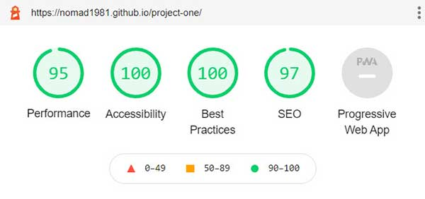
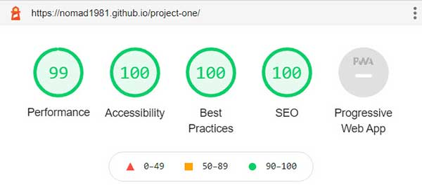
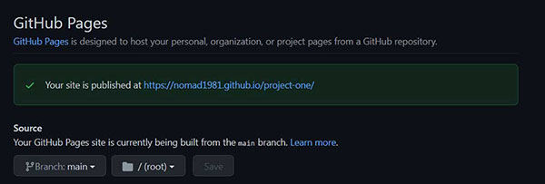
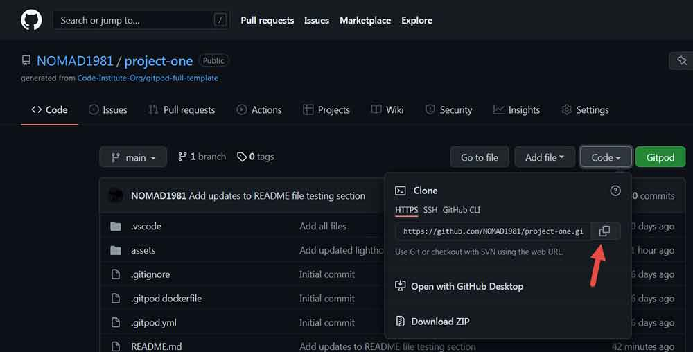
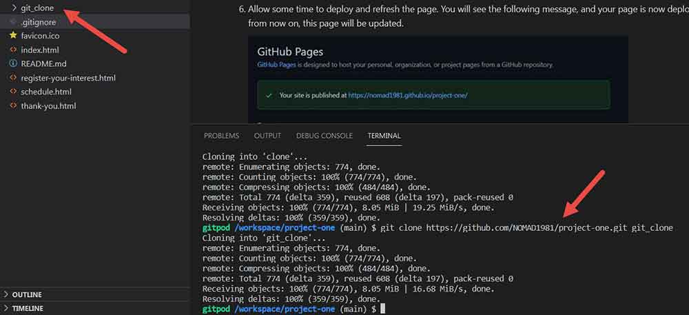
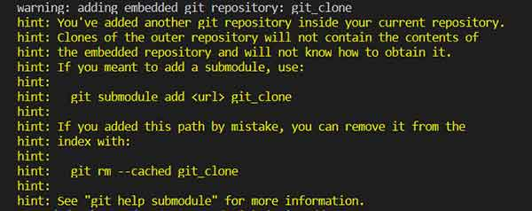

# **Buddhi Yoga Studio**

## [Buddhi Yoga Studio](https://nomad1981.github.io/project-one/) | Take your place at the seat of wisdom

(In Sanskrit: <a href="https://www.yogajournal.com/yoga-101/sanskrit/200-key-sanskrit-yoga-terms/" target="_blank" rel="noopener">Buddhi (“she who is conscious, awake”): the higher mind, which is the seat of wisdom (vidya, jnana); cf. manas</a>)

Buddhi Yoga Studio is a website for adults looking to practice yoga and meditation in the Clare area. This site offers the user information on a range of yoga and meditation techniques covered, an introduction to the teachers, single class and block booking pricing, the studio schedule, and a contact form to contact the studio directly with any queries they may have.
Buddhi Yoga Studio offers both in-studio and online classes via zoom.

*Buddhi Yoga studio is an imagined business. The people mentioned here do not exist, and the background story has been created for use in this project only.*

The last update to this file was: **January 29, 2022**

## Am I Responsive | Site Visual

# UX | User Experience

## User Requirements Feedback
* The user should be met with visuals that immediately illustrate the purpose of the site
* The user should be able to navigate through the site easily on all devices
* The user should be offered information on the services available, along with cost and class times
* The user should be introduced to the teachers, with a clear explanation of their experience and what classes they cover
* The user would like to see a map of the studio location
* The user would like to access the studio contact details
* The user would like to be submit a form which allows them to specify their class interests
* The user would like to see clear listings of the techniques covered and a brief overview of each

## Design & Visuals

* Colour

    - Article reviewed for inspiration: Colour Therapy for Yoga - [View Article](https://powerofnature.wordpress.com/2007/08/09/colour-therapy-for-yoga/)

        - Main Colour: Blue Violet - [#7c26cb](https://www.color-hex.com/color/7c26cb)
            - BLUE is calming and cooling to our system and hence, a good color to counteract hypertension. Spiritually it is the color of health and connects us to holistic thought.”
            - “VIOLET is cleansing, strengthening, and awakening. It has the power to suppress appetite restoring the peaceful environment. It affects the skeletal system of the body and is a good color for improving immunity, cancerous conditions, and arthritis. It also purifies the system and is an excellent color for headaches and migraines.”

        - Secondary Colour: Orange - [#e28a2b](https://www.color-hex.com/color/e28a2b)
            - “ORANGE is the color of joy and wisdom, energy and internal connection. It stimulates appetite and it is a good color for illnesses of the colon and digestion.”

        - Text Colours:
            - Charcoal Black [#2a2a2a](https://www.color-hex.com/color/2a2a2a)
            - Charcoal Grey [#333333](https://www.color-hex.com/color/333333)

        - Colour Scheme Visual:
            
            

* Logo & Typography

    - Fonts chosen based on their simplicity, legibility and complementary family pairing, with a contrast between serif and sans-serif display for interest:
        - [Merriweather Serif:](https://fonts.google.com/specimen/Merriweather) Main Headings
        - [Merriweather Sans:](https://fonts.google.com/specimen/Merriweather+Sans) Body & Paragraph

    - The styling includes a fall back to a standard serif or sans-serif font should either of these be unavailable for any reason or there is an issue with font import.

    - Letter spacing is included in the logo and some site headings for visual interest.

    - The logo uses [Merriweather Serif:](https://fonts.google.com/specimen/Merriweather) in Blue Violet [#7c26cb](https://www.color-hex.com/color/7c26cb) and includes a slight animation on page load in order to draw attention to the business name.

    - The 'praying hands' font awesome icon is used throughout the site, in the favicon, tagline and thank you page (after form submission) for continuity and support for the common phrase 'Namaste', a common term used in yoga and meditation circles. Coming from Hindi, as derived from the ancient Sanskrit, this term can be translated as “I bow to the divine in you". More information on it's origins can be [found here](https://en.wikipedia.org/wiki/Namaste). The 'praying hands' icon itself symbolises the the action that is taken upon greeting another with the phrase 'Namaste', which is often also followed with a bow of one's head in respect.

* Imagery

    - The photographic imagery used has been acquired through [Adobe Stock](https://stock.adobe.com/ie/) and is fully licensed under my AdobeCC subscription.
    - The lotus flower used as a background item on the home page was produced using Adobe Illustrator.
    - Imagery was exported through Photoshop and saved for web, then further optimised using [Compressor](https://compressor.io/).
    - Imagery has been resized, optimised and formatted for display at different breakpoints using media queries.
    - The video used on the schedule page is free to use and was acquired through the [Pexels website](https://www.pexels.com).

* Wireframes & Site Struture

    - The wireframes illustrate the main desktop visual, largely a two column design, with notes to reference the change to a one column layout on smaller screens. Approximate dimensions and structure are included, with some slight changes made during the development process.
    - On advice of my project leader, Kasia, the wireframes are hand-drawn, as oppose to the using Photoshop or Adobe XD as I had intended on doing inititally.

        - Home Page Wireframe - [view wireframe](assets/readme-images/home-page-mockup.jpg)
        - Schedule Page Wireframe - [view wireframe](assets/readme-images/schedule-page-mockup.jpg)
        - Registration Page Wireframe - [view wireframe](assets/readme-images/registration-page-mockup)
        - Thank You Page - no wireframe was created for this page as it was added afterwards. The form initially included the code institute form-dump link but my mentor advised me to create a separate 'thank you' page.

# Features

-   Fully responsive on all devices
-   Anchor linking inclusions to schedule and registration sections
-   Subtle logo animation and hover effects
-   Registration of interest for multiple class options, as required

# Technologies Used

## Languages
-   [HTML](https://www.w3schools.com/html/)
-   [CSS](https://www.w3schools.com/css/)

## Frameworks, Libraries & Programs Used
1.   [CSS Media Queries](https://fonts.google.com/) have been used heavily for visuals at relevant breakpoints.
2.   [Google Fonts](https://fonts.google.com/) has been used to import Merriweather Serif and Merriweather Sans into the style.css file in order that they be used within the html styling over the standard serif and sans serif fonts offered by the browser. A fall back to the default browser font has been included called in the css also, in case there should there be any issue with the import.
3.   [Font Awesome](https://fontawesome.com/) offers an easy solution for the inclusion of icons in any web based project. It offered a solution for the inclusion of the 'praying hands' icon in this project, which evokes the sentiment of spirituality associated with yoga and mediatation, thereby using a very simplistic representation of what is on offer on the site. It has also been used in the site favicon, to visually bind the overall studio vision and user psychology together.
4.   [Git](https://git-scm.com/) was used, in conjunction with the [Gitpod](https://www.gitpod.io/) terminal, to manage version control, commit changes and push these changes to GitHub.
6.   [GitHub](https://github.com/) offered a straightforward hostting solution for the website files.
7.   [Photoshop CC](https://www.adobe.com/ie/products/photoshop.html) was used for the sizing and exporting of images for web, in order to call different sizes and orientations for specific breakpoints. It was also used to further work on the vector image created in Illustrator CC, as mentioned below.
8.   [Illustrator CC](https://www.adobe.com/ie/products/illustrator.html) was used to create the lotus graphic background used on the home page, after which it was further processed through Photoshop.
9.   [Compressor](https://compressor.io/) was used to further optimise all imagery.
10.  [Pen & Paper](https://the-refinery.io/blog/tips-and-benefits-of-hand-drawn-wireframes) was used to create the wireframes for the project. This offered a quick visual representation of the basic site structure before getting stuck into coding.

# Testing

## 1. Lighthouse | Mobile Scores

-   The site was tested regularly for mobile scores on lighthouse throughout the project.

## 2. Lighthouse | Desktop Scores

-   The site was tested regularly for desktop scores on lighthouse throughout the project.

## 3. Lighthouse | Overall Testing Overview
-   I found lighthouse a very helpful tool to hone in on any performance related issues early on in the project. Based on initial results where performance was lagging, the advice was to create [WebP](https://en.wikipedia.org/wiki/WebP) images. However, I choose to call re-sized and optimised imagery at different breakpoints which alleviated this issue entirely and is commonly seen as best practice. Imagery was further optimised in Photoshop and run through Compressor, as mentioned above, which also contributed to alleviating the performance issues.

## 4. W3C Markup Validator: No Errors
-   [View Results](https://validator.w3.org/nu/?doc=https%3A%2F%2Fnomad1981.github.io%2Fproject-one%2F)

## 5. W3C CSS Validator: No Errors
-   [View Results](https://jigsaw.w3.org/css-validator/validator?uri=https%3A%2F%2Fnomad1981.github.io%2Fproject-one%2F&profile=css3svg&usermedium=all&warning=1&vextwarning=&lang=en)

## 6. UX  | User Experience Testing
-   The imagery offers clarity for the purpose of the site and the business immediately on load of the home page.
-   The site is easy to navigate, including a clear navigation bar, a flow of relevant information on each page and the site functions responsively.
-   The site offers navigation links immediately along with anchor links on slight scroll, giving them ample opportunity to find the information they may require.
-   The user can easily find all relevant information they may need quickly and clearly.
-   The user is introduced to the people running the studio/classes and their experience.
-   A map of the studio location and contact details for the studio are supplied to the user, along with social media links to keep up to date on a daily basis. The user can click to call the phone number directly or can use the email link to send an email.
-   The user can submit a form to register their interest in specific classes offered. They can include as many classes as they want and they can also choose to recive information on in-studio, online, or all options. This offers flexibility for the user.
-   The user is offered an overview of the different yoga and meditation techniques covered.

## 7. General Testing
-   Tested cross browser on Firefox, Chrome, Edge & Safari. It functions well on all browsers.
-   Heavily tested on a range of devices and breakpoints, where is performs smoothly. 
-   The form submission has been checked and it redirects to the 'thank you' page as it should.
-   All website links and anchors have been checked and are functioning correctly.

## 8. Peer Code Review
-   The site was [submitted for peer code review](https://code-institute-room.slack.com/archives/CGWQJQKC5/p1643309786571439) but I have had no response, as yet.

## 9. Known Bugs
-   I am unhappy with the display of the [thank you](https://nomad1981.github.io/project-one/thank-you.html) page, on iPad Air & iPad Mini in particular where there is far too much white space below the main page textt and the user should not be required to scroll to see the footer area. There is too much I had employed per device styling for visual of this page on many different devices, but when tested for validation it was noted that these media queries have been deprecated, which I was not aware of. The deprecated code used can be [viewed here](assets/css/deprecated.css). It was therefore removed. The nature of the page is that it includes very little content, with just a message to the user. As I spent much time on this item, I have had to park it but I will be researching this issue moving forward for my own understanding of a fix.

# Deployment to GitHub Pages
1.  Login to [GitHub](https://github.com/) & select the repository for deployment.
2.  Select 'Settings' on the top right of the screen.
3.  Scroll down to the 'GitHub Pages' section and you will see the message 'Pages settings now has its own dedicated tab! Check it out here!'. Click the link.
4.  Under 'Source' select the drop down and choose main (main/master branch), leave /root as is and select 'Save'
5.  You will note the link is created above stating 'your site is ready to be published at .....'
6.  Allow some time to deploy and refresh the page. You will see the following message, and your page is now deployed/hosted at GitHub. Any time you push to GitHub from now on, this page will be updated.

    

The link to my GitHub repository for this project can be [found here](https://github.com/NOMAD1981/project-one)

# Creation of Clone

1.  Open the repository for cloning
2.  Click on the 'Code' dropdown in the top right and select to copy the link under https, as illustrated below:

    
3. Open Git Bash
4. Change the current working directory to the location where you want the cloned directory to be made.
5. Type git clone, and then paste the URL copied from the 'Code' tab.
6. Press enter and the local clone is created.

# Issue I experienced with Cloning
1.  I followed steps 1 through 3 above
2.  I then entered 'git clone https://github.com/NOMAD1981/project-one.git git_clone' in order to create a clone within a folder in my current directory. The git_clone folder was created, as illustrated below.

    
3. On running 'git add .' I received the following warning, but proceeded to commit.

    

4. I noted issues whereby the GitHub page would not refresh and also had issues with the browser crashing.
5. I restarted and deleted the 'git_clone' folder then pushed the changes to GitHub.

# Credits

## Code
- The following articles were referenced as an overview of video functionality and breakpoints, respectively:
    - [Stack Overflow - centering of video](https://stackoverflow.com/questions/17508729/how-do-you-center-a-video-using-css)
    - [Stack Overflow - disabling autoplay](https://stackoverflow.com/questions/19664622/disable-html5-video-autoplay)
    - [Code Greeper - video placeholder](https://www.codegrepper.com/code-examples/html/html+video+placeholder)
    - [Free Code Camp - css breakpoints](https://www.freecodecamp.org/news/the-100-correct-way-to-do-css-breakpoints-88d6a5ba1862)
- Some css properties were checked and used from this link, which is also referenced in the css file - as below:
    - /* last 4 properties checked here https://www.w3schools.com/howto/howto_js_scroll_to_top.asp */
        - position: fixed; /* Fixed/sticky position */
        - bottom: 20px; /* Place the button at the bottom of the page */
        - right: 30px; /* Place the button 30px from the right */
        - z-index: 99; /* Make sure it does not overlap */

## Copyrighting
-   The following articles were referenced during creation of text content and to check terminology etc:
    - [Hatha Yoga Info](https://www.yogapedia.com/definition/4977/hatha-yoga)
    - [Iyengar Yoga Info](https://www.yogapedia.com/definition/5017/iyengar-yoga)
    - [Kundalini Yoga Info](https://www.yogapedia.com/definition/5024/kundalini-yoga)
    - [Guided Meditation Info](https://www.yogapedia.com/definition/11523/guided-meditation)
    - [Chakra Meditation Info](https://www.yogapedia.com/definition/11095/chakra-meditation)
    - [Qigong Meditation Info](https://www.yogapedia.com/definition/11045/qigong)

## Media
-   Imagery used has been acquired through [Adobe Stock](https://stock.adobe.com/ie/) and is fully licensed under my AdobeCC subscription.
-   The lotus flower background was produced using Adobe Illustrator.
-   The video is free to use and was acquired through the [Pexels website](https://www.pexels.com).

## Acknowledgements
-   I would like to thank our Cohort Facilitator on the course, Kasia Bogucka, for being an eternal ray of sunshine throughout this first project, and for offering support/advice wherever needed.
-   I would also like to thank my mentor Precious Ijege for useful feedback throughout, and providing me with the following links to review with regard creation of this README file:
    - [Code Institute Sample README.md](https://github.com/Code-Institute-Solutions/SampleREADME)
    - [Wawas Woods Sample README.md - produced by Ewan Colquhoun](https://github.com/EwanColquhoun/wawaswoods/blob/master/README.md#contents)
